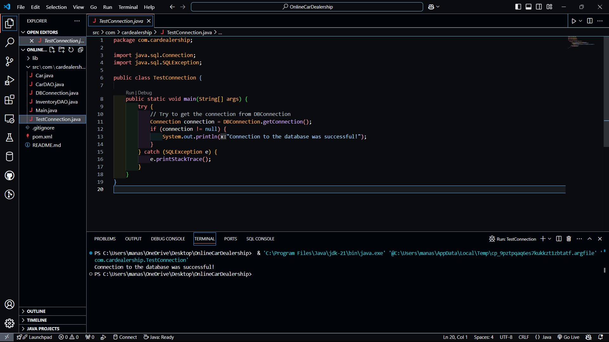

# 🚗 **Online Car Dealership System**

## 📜 **Project Description**

Welcome to the **Online Car Dealership System**! This is a web-based platform that connects **buyers**, **dealers**, and **admins** in a seamless car-buying and selling experience. Users can browse, sell, and purchase vehicles efficiently. The system features:

- **🔍 Car Search**: Find cars by price range.
- **🛠️ Inventory Management**: Dealers can add, update, and remove cars.
- **💳 Transactions**: Secure transactions between buyers and dealerships.
- **🛡️ Role Management**: Users have distinct roles with permissions.

---

## ✨ **Features**

- **User Roles**:  
    - **Buyer**: Browse cars, make purchases.
    - **Dealer**: Manage car inventory, view transactions.
    - **Admin**: Oversee all system activities.

- **🔎 Car Search by Price**:  
  Filter and find cars within your preferred price range.

- **💰 Transaction Management**:  
  Efficiently track and manage car purchase transactions between buyers and dealerships.

- **🔗 Database Connection**:  
  Connects to **MySQL** database to store vehicle, user, and transaction data.

---

## 🚀 **Technologies Used**

- **Java (JDK)**: Backend logic.
- **JDBC**: Database connectivity.
- **MySQL**: Database management.
- **VS Code**: Development environment.
- **MySQL JDBC Driver**: For connecting Java to MySQL.

---

## 🎨 **Preview of Database Connection**



---

## 🛠️ **Database Schema**

This project uses a MySQL database to store data about vehicles, users, dealerships, and transactions. Below is the schema for each table:

### 🚗 **Vehicles Table**

```sql
CREATE TABLE Vehicles (
    vehicle_id INT PRIMARY KEY AUTO_INCREMENT,
    make VARCHAR(50) NOT NULL,
    model VARCHAR(50) NOT NULL,
    year INT NOT NULL,
    mileage INT NOT NULL,
    price DECIMAL(10, 2) NOT NULL,
    description TEXT,
    images TEXT,
    vin VARCHAR(20) UNIQUE NOT NULL
);

👤 Users Table

CREATE TABLE Users (
    user_id INT PRIMARY KEY AUTO_INCREMENT,
    username VARCHAR(50) UNIQUE NOT NULL,
    email VARCHAR(100) UNIQUE NOT NULL,
    password VARCHAR(100) NOT NULL,
    phone_number VARCHAR(15),
    address TEXT,
    role ENUM('buyer', 'dealer', 'admin') DEFAULT 'buyer'
);

🏢 Dealership Table

CREATE TABLE Dealership (
    dealership_id INT PRIMARY KEY AUTO_INCREMENT,
    name VARCHAR(100) NOT NULL,
    address TEXT NOT NULL,
    phone_number VARCHAR(15),
    email VARCHAR(100),
    website VARCHAR(100),
    contact_person VARCHAR(100)
);

💳 Transactions Table

CREATE TABLE Transactions (
    transaction_id INT PRIMARY KEY AUTO_INCREMENT,
    user_id INT NOT NULL,
    vehicle_id INT NOT NULL,
    dealership_id INT NOT NULL,
    purchase_date DATE NOT NULL,
    payment_method ENUM('cash', 'credit', 'debit', 'loan') NOT NULL,
    total_price DECIMAL(10, 2) NOT NULL
);

🗂️ Project Structure

online-car-dealership/
    ├── src/
    │    ├── com/
    │    │    ├── cardealership/
    │    │    │    ├── Car.java
    │    │    │    ├── CarDAO.java
    │    │    │    ├── InventoryDAO.java
    │    │    │    └── DBConnection.java
    ├── lib/
    │    └── mysql-connector-java-x.x.x.jar (MySQL JDBC Driver)
    ├── assets/
    │    └── database-connection-success.png
    ├── .gitignore
    ├── README.md
    └── Main.java

🏁 How to Run the Project

	1.	Clone the Repository
Clone this repository to your local machine using the following command:

git clone https://github.com/your-username/online-car-dealership.git


	2.	Set Up MySQL Database
Ensure you have MySQL installed and running on your machine.
	•	Update the DBConnection.java file with your MySQL credentials.
	3.	Import Project in IDE
Open the project in your preferred IDE (e.g., VS Code).
	4.	Run the Application
Run the Main.java file to see the application in action and confirm the database connection.

🚨 License

This project is licensed under the MIT License. See the LICENSE file for details.

This **Markdown** code contains the complete project information, including the project description, features, technologies used, database schema, project structure, and instructions on how to run the project.